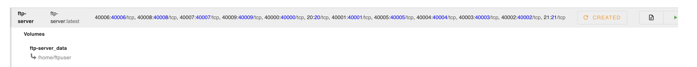
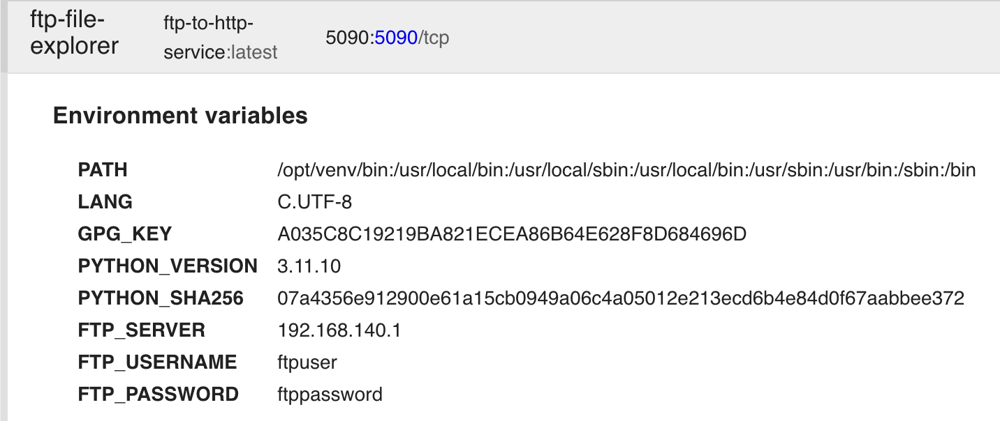
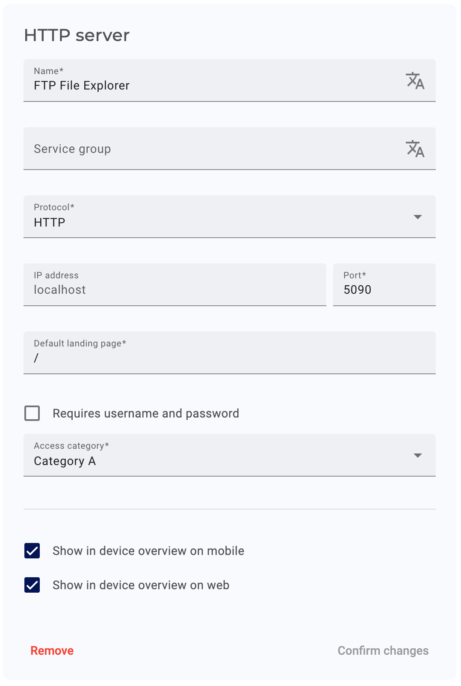

# Edge App - FTP File Explorer for SecureEdge Pro

This project demonstrates how to use an FTP server (for example, on a PLC) to browse and download files via a simple web interface hosted on the IXON SecureEdge Pro. The provided FTP server container is included for demonstration purposes; in production environments, you should use an external FTP server on the machine.

## Prerequisites

Ensure your environment is properly set up by following this guide: [Running custom Docker applications on the SecureEdge Pro](https://support.ixon.cloud/hc/en-us/articles/14231117531420-Running-custom-Docker-applications-on-the-SecureEdge-Pro).

## Local Development

docker-compose.yml is provided for local development.

## Application Overview

This application consists of two containers:

1. **FTP Server** (for demonstration purposes): A simple FTP server to simulate browsing and downloading files. In a production environment, this container is not required as you would use an external FTP server on the machine itself.
2. **FTP to HTTP Service**: A web service that connects to the FTP server and displays the files and directories through a web interface. Users can browse, view, and download files directly from the FTP server via the web interface.

## Steps to Deploy

### 1. Build and Push the Containers

Ensure you have the correct build environment configured:

For Unix-based systems:

```bash
./setup-buildx-env.sh
```

For Windows:

```cmd
setup-buildx-env.cmd
```

Run the script to build and push the FTP File Explorer containers to the SecureEdge Pro:

For Unix-based systems:

```bash
./build_and_push_containers.sh
```

For Windows:

```cmd
build_and_push_containers.cmd
```

### 2. Set Up the Containers on SecureEdge Pro

- Access the local web interface of the SecureEdge Pro.

#### FTP Server (for demonstration purposes)

- Create an `ftp-server` container using the `ftp-server` image with the following port mappings:

  ```
  Port Mapping: 20-21:20-21/tcp, 40000-40009:40000-40009/tcp
  ```

- This container is only needed for demonstration purposes. In production, use the FTP server on the machine.

- Start the container.

- Refer to the screenshot for configuration details:  
  

#### FTP to HTTP Service

- Create an `ftp-to-http-service` container using the `ftp-to-http-service` image with the following port mapping:

  ```
  Port Mapping: 5090:5090/tcp
  ```

- Overwrite the default environment variables, for security overwrite at least:

  ```
  FTP_PASSWORD
  ```

- Start the container.

- Refer to the screenshot for configuration details:  
  

### 4. Access the FTP File Explorer

- In IXON Cloud, create an HTTP Web Server to easily access the FTP File Explorer on the SecureEdge Pro.

- Refer to the screenshot for configuration details:  
  

### 5. Browsing and Downloading Files

- You can now access the FTP File Explorer on the SecureEdge Pro via the HTTP Web Server you created in IXON Cloud.

- The FTP File Explorer provides a simple web interface to browse the files and directories on the FTP server. Users can click on any file to download it directly to their local machine.
